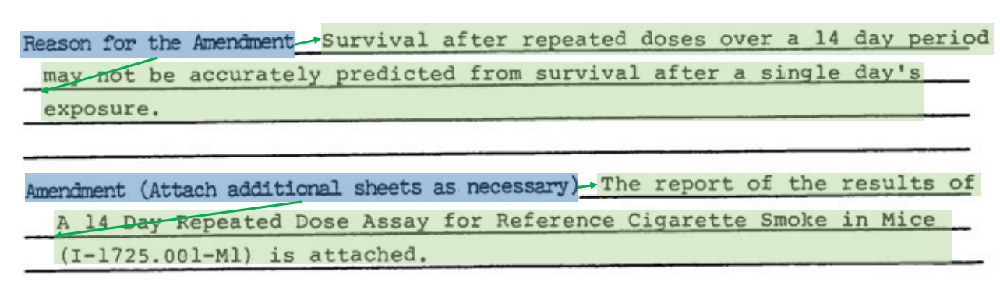

# RFUND: Relabeling FUNSD and XFUND dataset for Real-world Form Understanding

<a href="https://arxiv.org/abs/2401.03472">
    </img>
</a>
<a href="https://github.com/ZeningLin/PEneo">
    </img>
</a>


## Introduction

This repository is the official release of RFUND introduced in the MM'2024 paper "PEneo: Unifying Line Extraction, Line Grouping, and Entity Linking for End-to-end Document Pair Extraction".

RFUND is a relabeled version of FUNSD ([paper](https://ieeexplore.ieee.org/abstract/document/8892998),[dataset-release](https://guillaumejaume.github.io/FUNSD/)) and XFUND ([paper](https://aclanthology.org/2022.findings-acl.253/), [dataset-release](https://github.com/doc-analysis/XFUND)) dataset. We observed the following issues in their original annotations:

1. **Entity (block) level OCR results**. Real-world OCR engines usually produce line-level results, while the annotations in FUNSD and XFUND are at the entity (block) level. Text lines within the same entity are aggregated and serialized in human reading order, simplifying the task scope and failing to reflect real-world challenges.
2. **Inconsistent labeling granularity**. In FUNSD, while most contents are annotated at the entity level, multi-line entities with first-line indentation are annotated separately, in which the first line is split out and the rest are aggregated. XFUND exhibits variable granularity in annotations, with some contents labelled at the entity level and others at the line level. Such inconsistent labelling standards can hinder model training.
<div align="center">


</div>

3. **Erroneous category annotations**. Entities in FUNSD/XFUND are categorized as "header", "question", "answer" and "other". We observed that certain entities in both FUNSD and XFUND have category labels that differ from human understanding. In the following example, the *answer* entity “Client confirmed agreement ...” was labelled as *other*, while the *other* entity “CONFIDENTIAL” was labelled as the *question*.
<div align="center">

</div>

Our main modifications are as follows:

1. **Line-level annotation**: We relabeled the original dataset at the line level, which is more consistent with the output of real-world OCR engines.
2. **Linking annotation rectification**: We removed the redundant linking annotations caused by the inconsistent labelling granularity.
3. **Category annotation rectification**: We rectified the category annotations to make them consistent with human understanding.


## Usage

This repository only contains the [RFUND annotations](https://github.com/SCUT-DLVCLab/RFUND/releases). You can download the images from the original release of FUNSD and XFUND:
- [FUNSD Images](https://guillaumejaume.github.io/FUNSD/)
- [XFUND Images](https://github.com/doc-analysis/XFUND/releases/tag/v1.0)

The annotation JSON files are named as `{language}.{data_split}.json`. Language `en` refers to the FUNSD dataset. Contents in the annotation files are organized as follows:
```jsonc
{
  "documents": [ // list that contains annotations for each sample
    {
        "uid": "86236474_6476",
            "img": {                        // image information
                "fname": "86236474_6476.png",
                "height": 1000,
                "width": 754
            },
            "entities": [
                {
                    "id": 0,                // entity id
                    "label": "question",    // entity category (SER labels)
                    "lines": [              // list of lines in the entity, arranged in reading order
                        {
                            "id": "0",      // line id
                            "text": "TO:",  // line text content
                            "bbox": [       // line bounding box
                                47,
                                102,
                                74,
                                120
                            ]
                        },
                        // ...
                    ]
                },
                // ...
            ],
            "relations": {
                "kv_entity": [              // list of key-value pair relations (RE labels)
                    {
                        "from_id": 0,       // question entity id
                        "to_id": 1,         // answer entity id
                    },
                    // ...
                ],
                "line_grouping": [          // list of line grouping relations
                    {
                        "from_id": "0",       // id of the current line
                        "to_id": "1",         // id of the next line
                    },
                    // ...
                ]
            }
    },
    // ...
  ]
}
```


## License
RFUND is derived from FUNSD and XFUND, and its license adheres to the same terms and conditions as the original datasets. Please refer to the original licenses ([FUNSD](https://guillaumejaume.github.io/FUNSD/work/), [XFUND](https://github.com/doc-analysis/XFUND?tab=readme-ov-file#license)) for more details.


## Citation
If you find RFUND useful, please consider citing our paper:
```
@inproceedings{lin2024peneo,
  title={PEneo: Unifying Line Extraction, Line Grouping, and Entity Linking for End-to-end Document Pair Extraction},
  author={Lin, Zening and Wang, Jiapeng and Li, Teng and Liao, Wenhui and Huang, Dayi and Xiong, Longfei and Jin, Lianwen},
  booktitle={Proceedings of the 32nd ACM International Conference on Multimedia},
  year={2024}
}
```
